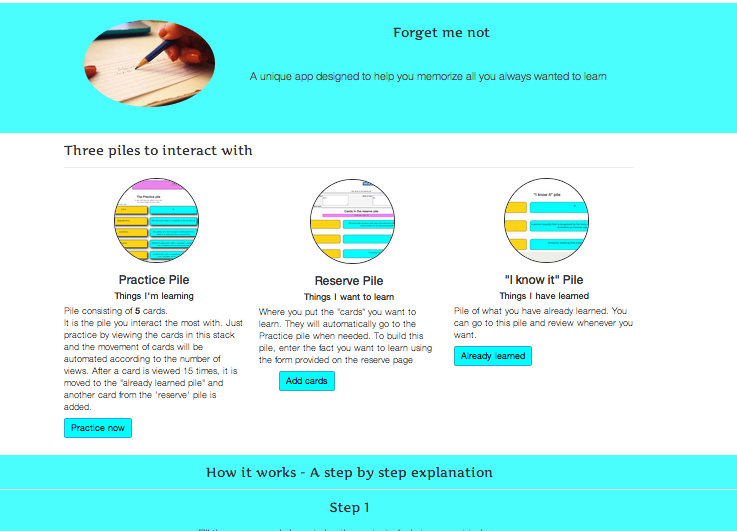
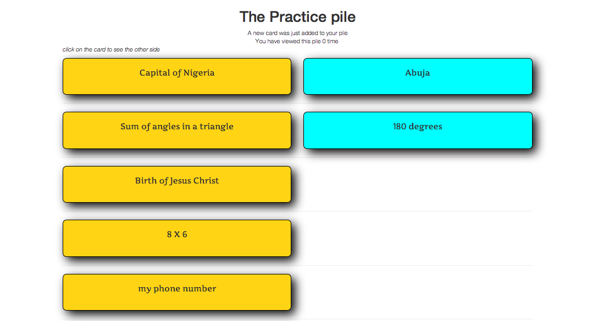

Forget Me Not
=============
First project in WDI Intensive Programm

This app is designed to help the user memorize things in a systematic way. The flow of cards is automated in line with student's progress. As the student studies the cards, the stack is updated automatically according to the number of times each card has been studied. 

 This app lives at http://warm-sierra-1277.herokuapp.com

Powered by:  
* Ruby (2.0) on Rails (4) 
* PostgreSQL 
* Bootstrap

